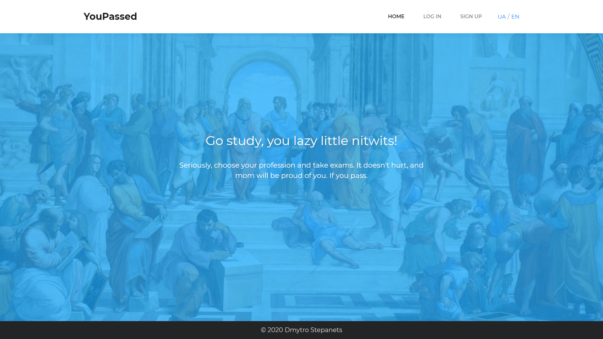
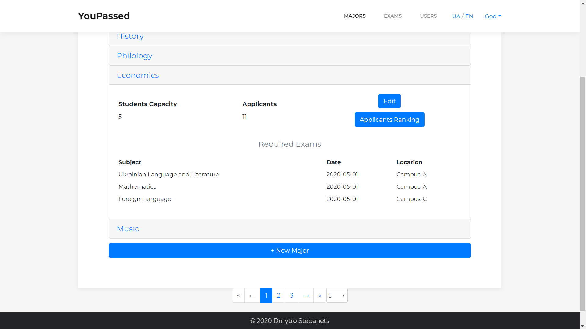
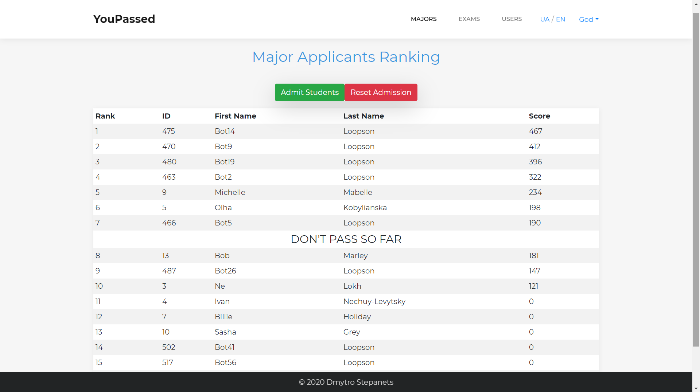
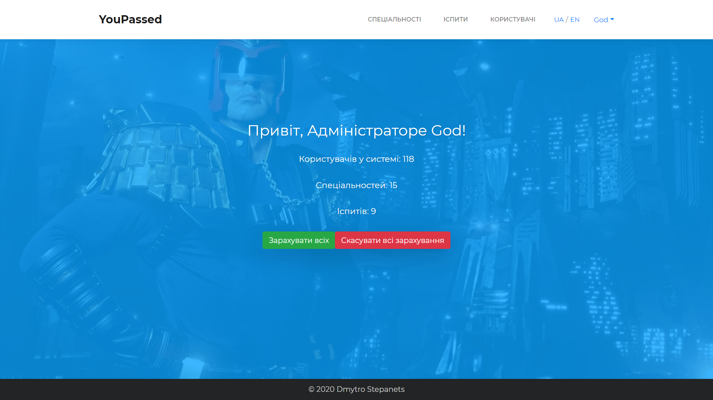
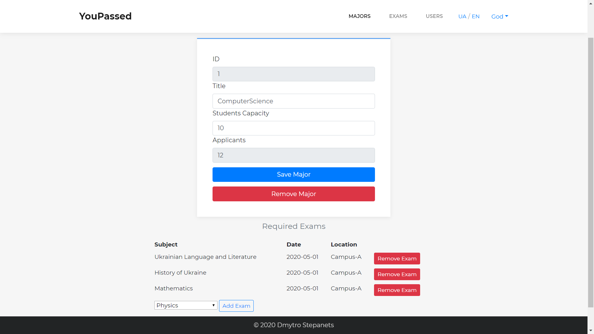

# YouPassed

University Admission Management System  - web application made on Java 8 with Spring and Hibernate frameworks.



## Description and Features

The application designed to help an institution of higher education to manage student applications and admission process. There are two *User Roles*: Student and Administrator.

**Student**: 
- chooses the profession - i.e. applies for a university major he/she wants to study;
- registers for the required exams; 
- receives a notification about being admitted.

**Administrator**: 
- inputs the marks for the exams that students registered to;
- confirms the admission of the best-ranking applicants for each major or all of them in a batch;
- also, Admin can add/remove majors and exams, edit data about them, change a user's role, etc.

All users can register, login, update their profiles.

*Two localizations available: English and Ukrainian.*



## Technology Stack
- Java SE 8
- Spring Core, Boot, MVC, Security
- MySQL database (and H2 for testing)
- Hibernate / JPA object-relational mapping instruments
- Thymeleaf template engine and Bootstrap CSS framework for the front-end
- Slf4j logging
- Maven

## Prerequisites
-	JDK 8 or higher
-	MySQL RDBMS (I’m using MySQL Community Server 8.0.19)
-	Maven build tool

## Usage

#### 1) Setup MySQL
-	In the configuration file 
`YouPassed/src/main/resources/application.properties`
change according to your MySQL settings these lines:
```
-spring.datasource.url 
-spring.datasource.username 
-spring.datasource.password
```
-	Run SQL scripts schema.sql and data.sql in YouPassed/db-setup/mysql/ to create a schema and generate initial data 

#### 2) Build the app with Maven
`mvn clean install`

#### 3) Run the app
`java -jar target/youpassed-1.0-SNAPSHOT.jar`

#### 4) Open it in a browser
`http://localhost:8080/`





